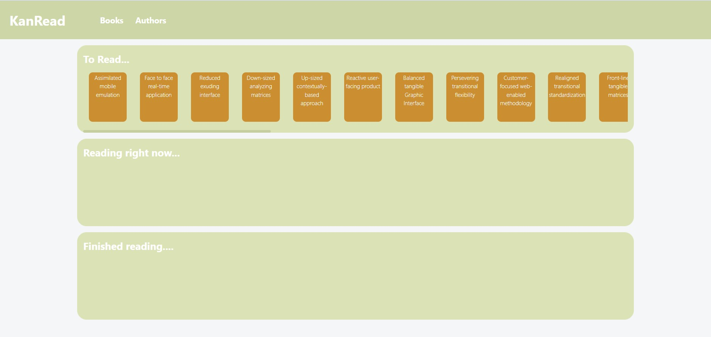
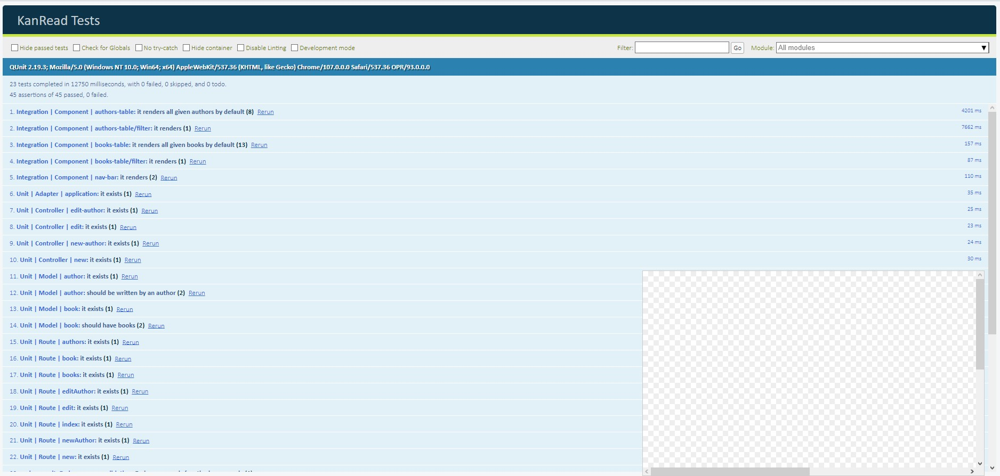

# kan-read

KanRead is a simple kanban board web application that tracks the status of what books want to be read. Users can create, update, and delete books and their authors as well as view the status of all their books from their index page.

## API

This web application handles two Ember models which are related to one another. Books have a many-to-one relationship with an author and an author has a one-to-many relationship with books. Below are each model's attributes.

In KanRead, users can click on book titles in the table or on the kanban board to view its details.

### Books

* Title
* Author Name
* Status

### Authors

* Name
* Book List


## Prerequisites

You will need the following things properly installed on your computer.

* [Git](https://git-scm.com/)
* [Node.js](https://nodejs.org/) (with npm)
* [Ember CLI](https://ember-cli.com/)
* [Google Chrome](https://google.com/chrome/)

This application was developed on Ember 3.24.0 and with Node versino 14.17.1. 

## Installation

```console
$ git clone https://github.com/jjwithanr/kan-read.git
```
```console
$ cd kan-read
```
```console
$ npm install
```

## Running / Development

```console
$ ember serve
```
* Visit the app at [http://localhost:4200](http://localhost:4200).


### Running Tests

* Visit the tests at [http://localhost:4200/tests](http://localhost:4200/tests).


* Or run the command below and visit the test server at [http://localhost:7357](http://localhost:7357/).
```console
$ ember test --server
```